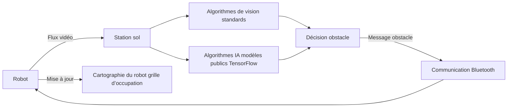

# Minstorm Object Detection (MID)

MinstormObjectDetection est un projet visant à implémenter une stratégie de détection d’obstacles à partir d’un flux vidéo fourni par un robot. Il constitue la première brique fonctionnelle pour améliorer l’autonomie et l’intelligence du robot.

Contrairement à une approche classique reposant uniquement sur des capteurs de distance (télémètre) ou de collision (capteur tactile), ce projet introduit une détection intelligente basée sur la vision, permettant de :

* identifier des obstacles visuellement,
* qualifier leur présence de manière plus fiable,
* intégrer ces informations directement dans la cartographie du robot.

## Principe général

La station sol analyse le flux vidéo remonté par le robot, détecte les obstacles, puis renvoie les informations pertinentes au robot via Bluetooth sous forme de messages JSON. Le robot décode ces messages et met à jour sa cartographie automatiquement.

## Stratégie de détection

### Détection standards (référence nominale)

Les algorithmes standards de vision par ordinateur constituent la chaîne de détection principale. Ils sont privilégiés pour :

* leur temps d’exécution maîtrisé,
* leur comportement déterministe,
* leur facilité de calibration et de débogage.

Ils peuvent inclure, selon les cas d’usage :

* détection de contours et de formes,
* segmentation par couleur ou par profondeur apparente,
* détection de mouvement (différentiel d’images),
* filtrage morphologique et heuristiques géométriques.

Leur sortie produit une hypothèse d’obstacle (présence, position relative, taille estimée).

### Détection basée sur l’IA (validation et plausibilisation)

En complément, le projet intègre des algorithmes de détection basés sur IA, reposant exclusivement sur des modèles publics pré‑entraînés (TensorFlow).

Ces algorithmes ne constituent pas la source décisionnelle principale. Leur rôle est de confirmer, invalider ou nuancer les résultats issus des algorithmes standards. La détection IA permet de :

* vérifier la cohérence d’une détection standard (plausibilisation),
* réduire les faux positifs dus à des artefacts visuels,
* détecter des obstacles difficiles à caractériser par des règles simples,
* apporter une mesure de confiance supplémentaire.

La confirmation est basée sur :
* Les algorithmes standards produisent une ou plusieurs hypothèses d’obstacles.
* Les algorithmes IA analysent le même flux vidéo (ou une région d’intérêt).
* Les résultats IA sont comparés aux hypothèses standards selon des critères tels que :
   * recouvrement spatial (overlap),
   * cohérence de position,
   * présence d’une classe d’objet plausible.
  
La confirmation de l'obstacle (confirmé, incertain voire rejeté) est ensuite transmise au robot.

